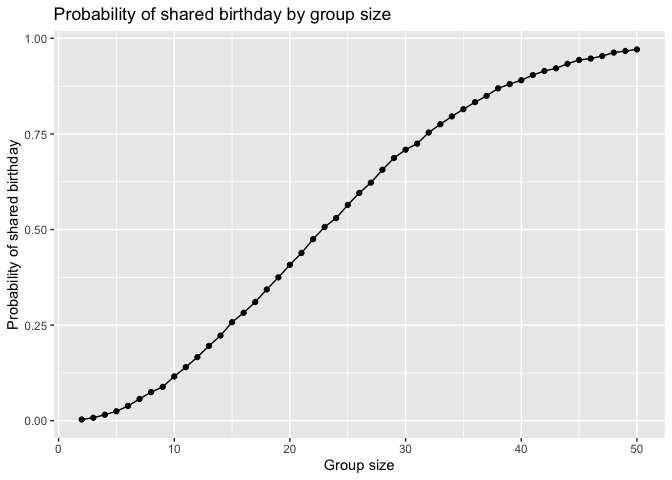
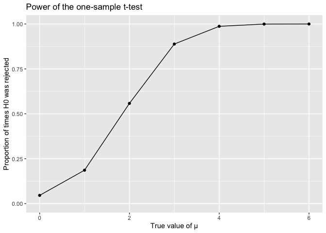
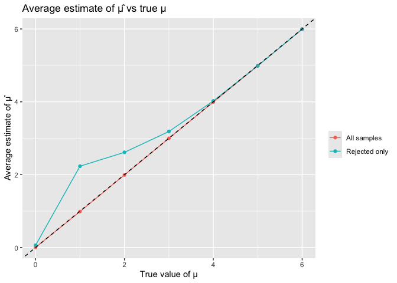

p8105_hw5_hl3978
================
Heather Lu
2025-11-14

# Problem 1

Suppose you put 𝑛 people in a room, and want to know the probability
that at least two people share a birthday. For simplicity, we’ll assume
there are no leap years (i.e. there are only 365 days) and that
birthdays are uniformly distributed over the year (which is actually not
the case).

Write a function that, for a fixed group size, randomly draws
“birthdays” for each person; checks whether there are duplicate
birthdays in the group; and returns TRUE or FALSE based on the result.

Next, run this function 10000 times for each group size between 2 and
50. For each group size, compute the probability that at least two
people in the group will share a birthday by averaging across the 10000
simulation runs. Make a plot showing the probability as a function of
group size, and comment on your results.

``` r
# b-day function: randomly draws “birthdays” for each person; checks whether there are duplicate birthdays in the group; and returns TRUE or FALSE based on the result.

bday_match <- function(n) {
  birthdays <- sample(1:365, size = n, replace = TRUE)
  any(duplicated(birthdays))
}

# run this function 10000 times for each group size between 2 and 50. 

group_sizes <- 2:50
n_sims <- 10000

# compute the probability that at least two people in the group will share a birthday by averaging across the 10000 simulation runs

shared_birthday_probs <- map_dbl(
  group_sizes,
  ~ mean(replicate(n_sims, bday_match(.x)))
)

shared_birthday_probs_df <- tibble(
  group_size = group_sizes,
  shared_birthday_prob = shared_birthday_probs
)

# Make a plot showing the probability as a function of group size
shared_birthday_probs_df |> 
  ggplot(aes(x = group_size, y = shared_birthday_prob)) + 
  geom_point() + 
  geom_line() + 
  labs(
    title = "Probability of shared birthday by group size",
    x = "Group size",
    y = "Probability of shared birthday"
  )
```

<!-- --> The
plot shows that the probability of at least two people sharing a
birthday increases non-linearly with group size. For very small groups
(fewer than about 10 people), the probability is close to zero. As the
group size increases, the probability grows quickly. Around 20–25 people
it crosses roughly 0.5.By the time the group size reaches about 40–50
people, the probability is above 0.8 and approaches 1.

# Problem 2

When designing an experiment or analysis, a common question is whether
it is likely that a true effect will be detected – put differently,
whether a false null hypothesis will be rejected. The probability that a
false null hypothesis is rejected is referred to as power, and it
depends on several factors, including: the sample size; the effect size;
and the error variance. In this problem, you will conduct a simulation
to explore power in a one-sample t-test.

First set the following design elements:

Fix 𝑛=30 Fix 𝜎=5 Set 𝜇=0 . Generate 5000 datasets from the model

𝑥∼𝑁𝑜𝑟𝑚𝑎𝑙\[𝜇,𝜎\]

For each dataset, save 𝜇̂ and the p-value arising from a test of 𝐻:𝜇=0
using 𝛼=0.05 . Hint: to obtain the estimate and p-value, use broom::tidy
to clean the output of t.test.

Repeat the above for 𝜇={1,2,3,4,5,6} , and complete the following:

- Make a plot showing the proportion of times the null was rejected (the
  power of the test) on the y axis and the true value of 𝜇 on the x
  axis. Describe the association between effect size and power.

- Make a plot showing the average estimate of 𝜇̂ on the y axis and the
  true value of 𝜇 on the x axis. Make a second plot (or overlay on the
  first) the average estimate of 𝜇̂ only in samples for which the null
  was rejected on the y axis and the true value of 𝜇 on the x axis. Is
  the sample average of 𝜇̂ across tests for which the null is rejected
  approximately equal to the true value of 𝜇 ? Why or why not?

``` r
# Function: generate one sample, return sample mean and p-value
sim_mean_p <- function(samp_size = 30, true_mean = 0, true_sd = 5, mu = 0) {
  sim_df <- tibble(
    x = rnorm(samp_size, true_mean, true_sd)
  )
  
  s_mean <- sim_df |> 
    summarize(
      samp_mean = mean(x),
      p_val = t.test(x, mu = mu) |>
        broom::tidy() |>
        pull(p.value)         
    )
  return(s_mean)
}

# Simulation settings
n <- 5000
mu_values <- 0:6

# Generate simulations for each true mean mu
sim_res_list <- map(mu_values, function(mu) {
  tibble(iter = 1:n) |> 
    mutate(
      samp_res = map(iter, ~ sim_mean_p(
        samp_size = 30,
        true_mean = mu,
        true_sd = 5,
        mu = 0
      ))
    ) |>
    unnest(samp_res)
})

names(sim_res_list) <- paste0("mu_", mu_values)

combined_results <- bind_rows(
  map2(sim_res_list, mu_values, ~ mutate(.x, mu = .y))
)

#1) power vs true mu
power_df <- combined_results |>
  group_by(mu) |>
  summarize(
    power = mean(p_val < 0.05),
    .groups = "drop"
  )

power_df |>
  ggplot(aes(x = mu, y = power)) +
  geom_point() +
  geom_line() +
  labs(
    title = "Power of the one-sample t-test",
    x = "True value of μ",
    y = "Proportion of times H0 was rejected"
  ) +
  ylim(0, 1)
```

<!-- -->

``` r
#2) Average estimates of mu-hat

# Average estimate using all samples
avg_df_all <- combined_results |>
  group_by(mu) |>
  summarize(
    est_mu = mean(samp_mean),
    .groups = "drop"
  ) |>
  mutate(type = "All samples")

# Average estimate using only samples where H0 was rejected
avg_df_reject <- combined_results |>
  filter(p_val < 0.05) |>
  group_by(mu) |>
  summarize(
    est_mu = mean(samp_mean),
    .groups = "drop"
  ) |>
  mutate(type = "Rejected only")

avg_estimates_df <- bind_rows(avg_df_all, avg_df_reject)

avg_estimates_df |>
  ggplot(aes(x = mu, y = est_mu, color = type)) +
  geom_point() +
  geom_line() +
  geom_abline(slope = 1, intercept = 0, linetype = "dashed") +
  labs(
    title = "Average estimate of μ̂ vs true μ",
    x = "True value of μ",
    y = "Average estimate of μ̂",
    color = ""
  )
```

<!-- -->

### Plot 1 – Power vs true μ

The plot shows that the power of the one-sample t-test increases as the
true mean μ moves away from 0. When μ = 0, the rejection rate is about
0.05, which matches the nominal type I error rate (α = 0.05). As μ
increases to 1, 2, 3, etc., the test becomes more likely to reject the
null, and power climbs quickly toward 1. This happens because larger
effect sizes shift the sampling distribution of the mean farther from
the null value, so the test statistic is more likely to fall in the
rejection region.

### Plot 2 – Average μ̂ (all vs rejected only)

The all samples line lies almost exactly on the dashed line, indicating
that the sample mean μ̂ is an unbiased estimator of μ: averaged over all
simulations, μ̂ is approximately equal to the true μ for each value.

The rejected only line lies above the dashed line for small μ, when μ is
between 1 and 3. If we only look at datasets where the null hypothesis
was rejected, the average estimate μ̂ is too large compared with the true
μ.
